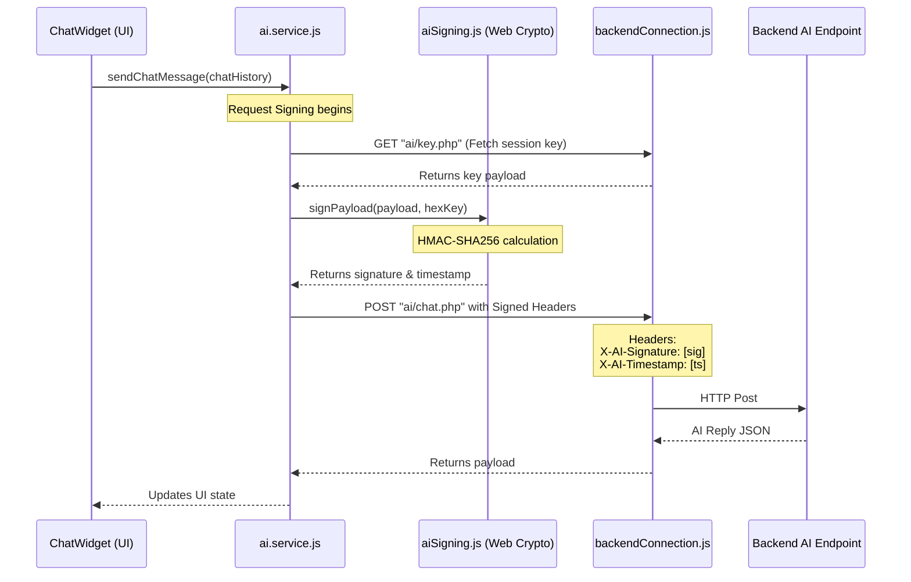

# CCS Sit-In Monitoring System — Frontend System Documentation

This document serves as the authoritative, code-driven technical reference for the **CCS Sit-In Monitoring System Client** application. It details the system's environment setups, folder layout, routing rules, session state management, custom hook behaviors, API architectures, design tokens, and critical code-level implementation details audited directly from the codebase.

---

## 1. Environment Configurations & Entry Points

### Environment Configuration (`.env`)
The frontend client relies on a single `.env` environment file in the project root to target the corresponding backend services:
*   **`VITE_API_URL`**: Defines the target URL of the PHP backend API server. In development mode, this is configured to:
    ```env
    VITE_API_URL=http://localhost/sitIn/api
    ```
    *Strict Security Standard:* No secret keys, API credentials, or private keys are exposed or saved inside the frontend configuration files.

### Vite Config & Path Proxying (`vite.config.js`)
To simplify CORS handling in local development and handle path routing correctly, Vite is configured with a development server proxy and custom plugin integrations:
```javascript
import { defineConfig } from 'vite';
import react from '@vitejs/plugin-react';
import tailwindcss from '@tailwindcss/vite';

export default defineConfig({
  plugins: [
    react(),
    tailwindcss()
  ],
  server: {
    port: 5173,
    proxy: {
      '/api': {
        target: 'http://localhost/sitIn/api',
        changeOrigin: true,
        rewrite: (path) => path.replace(/^\/api/, ''),
      },
    },
  },
});
```
*   **Path Proxy (`/api`)**: Re-routes client-side request calls prefixed with `/api` directly to `http://localhost/sitIn/api` without exposing CORS errors in the browser.
*   **Vite Plugins**: Bundles `@vite/plugin-react` for standard JSX parsing and `@tailwindcss/vite` (Tailwind CSS v4 compile integration) to build tailwind classes.

---

## 2. Core Architecture, Routing & Layouts

### Directory Architecture
The client-side React 19 application follows a modular, feature-oriented structure under `/src`:
*   `src/components/`: Reusable graphical user interface elements.
    *   `src/components/ui/`: Atomic elements (Badge, Button, Card, Input, Select, Pagination).
    *   `src/components/modals/`: Specialized confirmation, feedback, details, and alert overlay modals.
    *   `src/components/notifications/`: Notification feed structures.
*   `src/context/`: Context Provider modules (e.g. `AuthContext.jsx`) managing global React states.
*   `src/hooks/`: Custom state hooks (`useAuth`, `useAlert`, `useConfirm`, `useNotifications`).
*   `src/pages/`: Main page components separated by role access:
    *   `src/pages/Auth/`: Login, Register, Forget Password forms.
    *   `src/pages/Student/`: Dashboard, history tables, session bookings, and feedback forms.
    *   `src/pages/Admin/`: Management screens for active sit-ins, workstation reservations, lab settings, and metrics.
*   `src/services/`: API client services communicating with backend endpoints.
*   `src/utils/`: Shared functional helper utilities (date formatters, token validators, encryption signing).

### Central Router Configuration (`src/App.jsx`)
App navigation and component rendering are controlled using **React Router (v7)**. The application maps routes inside `src/App.jsx` as follows:

```jsx
<HashRouter>
  <AuthProvider>
    <Routes>
      {/* Public Pages */}
      <Route path="/" element={<Home />} />
      <Route path="/login" element={<Login />} />
      <Route path="/register" element={<Register />} />
      
      {/* Student Private Section */}
      <Route element={<ProtectedRoute allowedRoles={['student']} />}>
        <Route element={<StudentLayout />}>
          <Route path="/student/dashboard" element={<StudentDashboard />} />
          <Route path="/student/reservations" element={<StudentReservations />} />
          <Route path="/student/history" element={<StudentHistory />} />
          <Route path="/student/notifications" element={<StudentNotifications />} />
          <Route path="/student/edit-profile" element={<StudentEditProfile />} />
          <Route path="/student/announcements" element={<StudentAnnouncements />} />
          <Route path="/student/announcements/:id" element={<StudentAnnouncementDetail />} />
          <Route path="/student/testimonials" element={<StudentTestimonials />} />
        </Route>
      </Route>

      {/* Admin Private Section */}
      <Route element={<ProtectedRoute allowedRoles={['admin']} />}>
        <Route element={<AdminLayout />}>
          <Route path="/admin/dashboard" element={<AdminDashboard />} />
          <Route path="/admin/sit-in" element={<AdminActiveSitIn />} />
          <Route path="/admin/reservation" element={<AdminReservations />} />
          <Route path="/admin/students" element={<AdminStudents />} />
          <Route path="/admin/sit-in/records" element={<AdminSitInRecords />} />
          <Route path="/admin/sit-in/history" element={<AdminSitInHistory />} />
          <Route path="/admin/reports" element={<AdminReports />} />
          <Route path="/admin/announcements" element={<AdminAnnouncements />} />
          <Route path="/admin/feedback" element={<AdminFeedback />} />
        </Route>
      </Route>
      
      {/* Fallbacks */}
      <Route path="*" element={<Navigate to="/" replace />} />
    </Routes>
    <ChatWidget />
    <Toaster position="top-right" richColors />
  </AuthProvider>
</HashRouter>
```

### Route Guards & Layouts
1.  **`ProtectedRoute.jsx`**: Inspects `AuthContext` to determine if a user session is active.
    *   If no session is found, redirects users to `/login`.
    *   If a session exists but the user's role does not match the `allowedRoles` array, redirects to the home page `/`.
2.  **`StudentLayout.jsx`**: Renders the student-specific responsive navigation bar, main sidebar, main page content area, and mobile-friendly layouts.
3.  **`AdminLayout.jsx`**: Provides the administrative header, system control sidebar, layout adapters, theme toggles, and notification dropdown access points.

---

## 3. State Management & Authentication Flow

### Session State Store (`AuthContext.jsx`)
The authentication state is managed via `AuthContext` using a React Provider structure (`AuthProvider`), wrapping the entire application tree inside `App.jsx`.
*   **State variables**:
    *   `user`: Holds parsed session properties or DB-synced profiles (e.g. `{ student_id, first_name, last_name, role, session, profile_pic }`).
    *   `isLoading`: Controls visual splash screen displays during early verification checks.
*   **Exposed attributes**: `{ user, login, logout, isAdmin, isStudent, isLoading }`.

### JWT Validation & Persistence (`src/utils/authToken.js`)
Session credentials reside in **`sessionStorage`** using the **`authToken`** key. Helper routines inside `authToken.js` govern validation:
*   `getStoredAuthToken()`: Retrieves the JWT from `sessionStorage`.
*   `hasTokenExpired(token, offsetSeconds = 0)`: Extracts the `exp` timestamp from the token's JSON payload. Returns `true` if current time exceeds `exp - offsetSeconds` (the app uses a default 10-second margin to handle late-bound network delays).
*   `decodeJwtPayload(token)`: Decodes the base64url payload segment to parse the encoded JSON structure:
    ```javascript
    const payload = decodeJwtPayload(token);
    const tokenData = payload?.data || {};
    ```
*   `clearStoredAuthSession()`: Erases `"authToken"` from storage on logout or session expiration.

### Session Auto-Sync & Expiry Workflows
1.  **On Mount Sync**: When `AuthProvider` mounts, it reads `sessionStorage`.
    *   If a token exists and is valid, it decodes the core payload.
    *   If the user is a `student`, it calls `studentService.getProfile()` to pull the freshest database properties (remaining session credits, profile pictures, updated names) and updates the local state.
    *   If `studentService.getProfile()` fails with a HTTP `401 Unauthorized` response, it executes token erasure and returns the student to the login page.
    *   If the user is an `admin`, it trusts the decoded JWT values directly.
2.  **Expiration Broadcasts**: An Axios response interceptor intercepts incoming traffic. If a `401 Unauthorized` is captured (signifying token expiration), it publishes a custom event to the global window:
    ```javascript
    window.dispatchEvent(new CustomEvent('auth:expired'));
    ```
    The `AuthProvider` subscribes to the `'auth:expired'` event. Upon capture, it resets `user` state to `null` and wipes storage immediately.

---

## 4. Custom Hook Suite & Specialized Modals

### Custom Hook Architectures
The system uses custom React hooks to isolate complex, stateful flows:

#### 1. `useNotifications(pollingInterval = 5000)`
Manages student notification list synchronization by utilizing an **Observer Pattern** paired with a active **5-second polling interval** to keep multiple components in sync without requiring heavy WebSockets.
*   **States managed**: `notifications` list, `unreadCount`, `isLoading`.
*   **Routines**:
    *   `fetchNotifications(silent)`: Executes parallel queries to `getUnreadCount()` and `getAll()`. In silent mode, if a higher unread count is detected compared to the prior state, it triggers a `sonner` toast warning alerting the student:
        ```javascript
        toast.info(latest.message, {
          description: 'New Notification Received',
          action: {
            label: 'View',
            onClick: () => window.location.hash = '/student/notifications'
          }
        });
        ```
    *   `markAsRead(id)`: Invokes the update endpoint and decrements local counts.
    *   `markAllRead()`, `clearAll()`: Flushes API tables and cleans hooks.
*   **Observer syncing**: Uses a static global `observers` Set:
    ```javascript
    const observers = new Set();
    const notifyObservers = (data) => observers.forEach((callback) => callback(data));
    ```
    Every hook mount attaches its state setter to the set. When any hook instance updates states, it broadcasts the values globally, immediately synchronizing other active instances (e.g. Header counters and Profile tables).

#### 2. `useConfirm()` & `useAlert()`
Imperative, Promise-based state containers that eliminate browser-native blockages (`window.confirm` and `window.alert`) while strictly matching styling guidelines.
*   **Routines**:
    *   `confirm(options)`: Instantiates a Promise that resolves `true` on confirm or `false` on cancel/close:
        ```javascript
        const ok = await confirm({
          title: 'Terminate Session',
          message: 'Are you sure you want to end this student session?',
          variant: 'danger'
        });
        if (ok) { /* Action execution */ }
        ```
    *   `alert(options)`: Resolves a Promise when the user clicks 'Understood'.
*   **JSX Wrappers**: Exposes `{ ConfirmModalUI }` or `{ AlertModalUI }` which must be placed inside the parent page's JSX layout.

---

### Specialized Modal Systems

#### `ConfirmModal`
Implements a refined, high-fidelity overlay with three theme modes:
1.  **`danger`**: Renders red `Trash2` icons with warning backgrounds. Default confirm label: `"Yes, Delete"`.
2.  **`warning`**: Renders amber `AlertTriangle` warning icons. Default confirm label: `"Yes, Continue"`.
3.  **`info`**: Renders navy `ShieldAlert` info icons. Default confirm label: `"Confirm"`.
*   *Interactive Specs:* Fully animated via `animate-fade-in` and `animate-fade-in-up`, blocking underlying panels using `bg-primary/50 backdrop-blur-sm z-[120]` and offering non-destructive `cancel` clicks alongside loading trackers.

#### `BulkPcModal`
Empowers administrators to perform massive grid selection updates on lab workstations.
*   **Drag-To-Select selection mechanism**:
    *   Registers `mousedown` and `mouseenter` events across workstation cards.
    *   On mouse down on a valid grid item, sets dragging state `isDragging = true` and records toggle mode (`"select"` or `"deselect"`).
    *   Moving across other elements adds or removes IDs dynamically within `selectedPcIds`.
    *   Global `mouseup` event on window listener stops drag captures safely.
*   **Safety protection constraint**: Workstations matching reservation statuses `occupied` or `reserved` are locked (`isProtected = true`). They appear partially transparent, ignore drag events, and remain disabled from bulk batch edits.
*   **Apply Sidebar actions**: Offers two batch operational targets:
    *   *Hardware Statuses:* Active, Disabled, Under Maintenance (triggers `pcService.updatePcStatus`).
    *   *Booking Statuses:* Open (Available), Reserved, Occupied (triggers `pcService.updateReservationStatus`).

---

## 5. API Service Layer & AI Integration

### Global Axios Connector (`src/services/backendConnection.js`)
All database transactions flow through a central Axios instance:
*   **Instance Base**: Connects to `/api` (locally proxied) or `import.meta.env.VITE_API_URL`.
*   **Request Interceptors**: Intercepts requests to automatically attach authorization tokens:
    ```javascript
    api.interceptors.request.use((config) => {
      const token = getStoredAuthToken();
      if (token) {
        config.headers['Authorization'] = `Bearer ${token}`;
        config.headers['X-Auth-Token'] = token;
      }
      return config;
    });
    ```
*   **Response Interceptors**: Catches incoming errors. If a response matches HTTP `401 Unauthorized`, it raises the `'auth:expired'` event to trigger redirect flows.

---

### AI Integration & Request Signing (`src/services/ai.service.js` & `src/utils/aiSigning.js`)
The application features a secure, signed chat interface with AI capabilities. To prevent forgery, all AI requests are cryptographically signed before transmission.



#### HMAC-SHA256 Signing Implementation (`src/utils/aiSigning.js`)
Using the modern Web Crypto API, the signing helper parses payloads and hashes them against a server-provided dynamic key:
```javascript
export async function signPayload(payloadString, hexKey) {
  const encoder = new TextEncoder();
  const keyBytes = new Uint8Array(hexKey.match(/.{1,2}/g).map(byte => parseInt(byte, 16)));
  const dataBytes = encoder.encode(payloadString);

  const cryptoKey = await crypto.subtle.importKey(
    "raw",
    keyBytes,
    { name: "HMAC", hash: { name: "SHA-256" } },
    false,
    ["sign"]
  );

  const signatureBuffer = await crypto.subtle.sign("HMAC", cryptoKey, dataBytes);
  const signatureArray = Array.from(new Uint8Array(signatureBuffer));
  return signatureArray.map(b => b.toString(16).padStart(2, "0")).join("");
}
```

#### Signed POST Actions (`src/services/ai.service.js`)
The service implements a sequence of key retrieval, payload stringifying, signing, and header appending:
1.  **Retrieve Key**: Performs a `GET` request on `ai/key.php` to fetch a unique signing hex key. To reduce backend overhead, the key is cached in local memory during the session lifecycle.
2.  **Generate Timestamp**: Records a standard Unix timestamp (`Math.floor(Date.now() / 1000)`).
3.  **Prepare Payload**: Concatenates timestamp + stringified payload:
    ```javascript
    const timestamp = Math.floor(Date.now() / 1000);
    const payloadString = timestamp + JSON.stringify(chatHistory);
    ```
4.  **HMAC Signature**: Invokes `signPayload(payloadString, hexKey)` using the Web Crypto API.
5.  **Post Call**: Calls the POST endpoint (`ai/chat.php`) with special cryptographic headers:
    *   `X-AI-Signature`: The generated HMAC-SHA256 signature hash.
    *   `X-AI-Timestamp`: The recorded epoch timestamp.

#### Quota & Cooldown Systems (`src/components/ChatWidget.jsx`)
The AI Chat widget features built-in usage limit management to protect backend services:
*   Calls `getQuotaStatus()` (`GET` `ai/quota.php`) on mount to retrieve constraints: remaining chat limits (e.g. `9/10 left`) and cooldown periods (`cooldown_remaining`).
*   If a cooldown period is active, the chat input is locked and displays a remaining time countdown (e.g., `"Wait 45s..."`).
*   If the backend throws a cooldown error during transmission, the chat interface captures the `retry_after_seconds` header and immediately locks input capabilities.

---

### Domain-Specific API Services

| File | Context / Domain | HTTP Method | Endpoint Target | Payload Parameters / Queries |
| :--- | :--- | :--- | :--- | :--- |
| `auth.service.js` | Login | `POST` | `auth/login.php` | `{ username, password }` |
| | Register | `POST` | `auth/register.php` | `{ first_name, last_name, email, course, course_level, address, student_id, username, password, profile_pic }` |
| | Logout | `POST` | `auth/logout.php` | *(Uses Bearer Tokens)* |
| `student.service.js` | Get Profile | `GET` | `student/profile.php` | *(Returns logged-in student info)* |
| | Update Profile | `POST` | `student/profile.php` | `FormData` (includes `profile_pic` file) |
| `sitin.service.js` | Active Sessions | `GET` | `sitin/active_sessions.php` | *(List of currently timed-in students)* |
| | Get History | `GET` | `sitin/history.php` | `{ page, per_page, search }` |
| | Get Dashboard Stats | `GET` | `sitin/dashboard_stats.php` | *(Accumulated student durations & labs)* |
| `lab.service.js` | List Labs | `GET` | `lab/read_all.php` | *(Lab codes, names, capacities)* |
| | Get Lab Rules | `GET` | `lab/rules.php` | *(Dynamic list of rules from database)* |
| `pc.service.js` | Get Lab PCs | `GET` | `pc/pcs.php` | `{ params: { lab_id } }` |
| | Update PC Status | `POST` | `pc/update_pc_status.php` | `{ id, pc_status }` (Hardware level) |
| | Update Booking Status| `POST` | `pc/update_reservation_status.php`| `{ id, reservation_status }` |
| `course.service.js` | Get Courses | `GET` | `course/read_all.php` | *(List of registered university courses)* |
| `announcement.service.js`| Get Announcements | `GET` | `announcement/read_all.php` | `{ page }` |
| `notification.service.js`| Get Unread Count | `GET` | `notification/unread_count.php`| *(Integer count)* |
| | List Notifications | `GET` | `notification/read_all.php` | *(All alerts)* |
| | Mark as Read | `POST` | `notification/mark_as_read.php` | `{ id }` |
| | Mark All Read | `POST` | `notification/mark_all_read.php` | *(Wipes unread indicators)* |
| | Delete All | `POST` | `notification/delete_all.php` | *(Deletes student alerts)* |
| `reservation.service.js` | Create Reservation | `POST` | `reservation/create.php` | `{ lab_id, pc_number, reserved_date, reserved_time }` |
| | List Reservations (Student)|`GET` | `reservation/my_reservations.php`| *(Self-booked reservation queue)* |
| | Cancel Reservation | `POST` | `reservation/cancel.php` | `{ id }` |
| | Student Reschedule | `POST` | `reservation/reschedule.php` | `{ id, reserved_date, reserved_time }` |
| | Lab Occupied PCs | `GET` | `reservation/occupied_pcs.php` | `{ lab_id, date, time_slot }` |
| | List All (Admin) | `GET` | `admin/reservations/read_all.php`| `{ params: { status } }` |
| | Update Status (Admin) | `POST` | `admin/reservations/update_status.php`| `{ id, status, admin_note }` |
| | Convert to Sit-in | `POST` | `admin/reservations/convert_to_sitin.php`| `{ reservation_id }` (Fast track conversion) |
| | Get Audit Logs | `GET` | `admin/reservations/audit_log.php`| `{ entity_type, date_from, date_to, page, perPage }` |
| | Get Settings | `GET` | `reservation/settings.php` | *(Reservation availability toggles)* |
| | Save Settings | `POST` | `reservation/settings.php` | `{ enabled }` |

---

## 6. Shared Components & Design Tokens

### Core Design System & Tokens (`src/index.css`)
The CCS Sit-In platform adopts a premium **"Refined Minimalist"** design language configured dynamically through Tailwind CSS v4 variables:

*   **Primary Brand Colors**:
    *   Navy Accent (`--color-primary` / `#001F3F`): Primary branding, headings, and high-importance UI elements.
    *   Ocean Blue (`--color-primary-hover` / `#3A6D8C`): Mid-ground interactions, active buttons, hover outlines.
    *   Steel Blue (`--color-primary-light` / `#6A9AB0`): Secondary titles, labels, placeholders.
    *   Champagne Gold (`--color-brand-sand` / `#EAD8B1`): Warm brand highlights, badges, and warning accents.
*   **Warm Palette Foundations**:
    *   Body Background (`#FDFBF7`): Moving away from sterile whites to cozy warm stone backgrounds.
    *   Warm Secondary Surface (`--color-bg-secondary` / `#faf8f5`): Softer cards and sidebar backgrounds.
    *   Navy Tinted Border (`--color-border` / `rgba(0, 31, 63, 0.1)`): Semi-transparent navy outlines matching the palette structure.
*   **Theme Typography**:
    *   Primary Font (`--font-sans`): `'Poppins', system-ui, -apple-system, sans-serif` to display crisp, highly readable headings and interface elements.

#### Border Radius Scale
To maintain a strict and elegant aesthetic consistency, component corners are assigned uniform roundings:
*   `--radius-md` (**6px**): Standard controls (Buttons, Text Inputs, Dropdowns).
*   `--radius-lg` (**12px**): Main cards, containers, grid boxes.
*   `--radius-xl` (**18px**): System Modals, hero headers, dashboard sections.

#### Shadow Elevations
*   `shadow-sm` (`0 1px 2px rgba(0, 31, 63, 0.05)`): Input focus elevations, subtle card highlights.
*   `shadow-md` (`0 4px 10px rgba(0, 31, 63, 0.04), 0 1px 2px rgba(0, 31, 63, 0.08)`): Main sidebar elevations, dropdown menus, float actions.

#### Dark Mode Architecture
Managed through a system theme attribute `[data-theme="dark"]`. The colors are systematically mapped to highly-legible dark tones:
*   Body background transitions to deep midnight blue (`#060d1a`).
*   Cards and elevated surfaces adopt dark navy layers (`#0f1d33` / `#16263f`).
*   Fonts scale to clean cloud white (`#f0f7ff`).
*   Extensive styling overrides guarantee that common utility classes (like `.bg-white` and `.text-primary`) dynamically adapt color ratios without reversing contrast hierarchies.

---

### UI Component Signatures

#### `Pagination`
*   **Props**: `currentPage` (int), `totalPages` (int), `onPageChange` (func), `maxVisible` (int, default: 10).
*   **Audited Code Behavior**: Returns a responsive layout showing previous/next buttons and ellipsis gaps. Unlike standard pagination elements that hide when a single page exists, this component **always remains visible in the DOM** even if `totalPages <= 1` is met.

#### `CourseSearchableDropdown`
*   **Props**: `value` (string), `onChange` (func), `placeholder` (string), `className` (string).
*   **Behavior**: Dynamically retrieves the registered university course list from `courseService.getCourses()` on mount, displays an input field inside the dropdown that automatically focuses upon opening, handles search-as-you-type client-side filtering, and registers outside click listeners to handle closing.

#### `Badge`
*   **Props**: `variant` (`"primary" | "secondary" | "success" | "warning" | "error" | "outline"`), `children` (node), `className` (string).
*   **Styles**: Applies custom background colors matching status states (e.g. green for success, red for error, gold for warning) with rounded corners.

#### `Button`
*   **Props**: `variant` (`"primary" | "secondary" | "danger" | "ghost" | "outline"`), `size` (`"sm" | "md" | "lg"`), `isLoading` (bool), `children` (node).
*   **Styles**: Standardized button elements with transition durations, hover opacity changes, and spin loaders.

---

## 7. Critical Audit Findings & Resolutions

During our deep-dive technical audit of the Sit-In Monitoring frontend codebase, we analyzed the source code files and identified key implementation decisions and discrepancies between design specifications and runtime behavior.

### 1. Code vs. Specification Discrepancies
*   **Persistence Store Choice**: Previous plan references suggested using `localStorage` for session JWT credentials. However, the audited code in `src/utils/authToken.js` exclusively binds authentication tokens to **`sessionStorage`** using the **`authToken`** key. This security decision isolates student sessions to individual tabs, automatically logging out users when the tab is closed.
*   **Pagination Component Rendering**: Initial UI mockups indicated that pagination controls should be hidden if a query contains only a single page of results. The audited source code in `src/components/ui/Pagination.jsx` explicitly states:
    ```javascript
    // Always show pagination even if only 1 page exists
    ```
    The component continues to render in the DOM even if `totalPages <= 1` is met to preserve layout sizing across search queries.
*   **Bulk Workstation Selection**: The `BulkPcModal` workstation grid utilizes dynamic drag-selection, but applies a strict **safety protection layer** to lock down PCs in `"occupied"` or `"reserved"` states. This overrides standard status toggling requests, protecting active student sessions from accidental remote termination by administrators.

### 2. High-Utility Page Implementations
*   **Today's Approved Reservation Priority (`AdminReservations.jsx`)**: The reservation queue automatically prioritizes entries matching the current date (`new Date().toLocaleDateString("en-CA")`), sorting them chronologically by time so that administrators can quickly process active student arrivals.
*   **Live Coexistence Guard (`AdminReservations.jsx`)**: Before launching a sit-in session from an approved reservation, the application queries active sessions. If the student is already logged into another computer in the system, it displays a conflict warning to prevent parallel session duplication.
*   **Timeline-Driven Search Navigation (`AdminReservations.jsx`)**: Audit log entries are highly interactive. Clicking an activity timeline log parsing a reservation ID (e.g., `"Reservation #243 approved"`) switches the reservation tab to `"All"`, highlights the targeted row with a brief pulsing outline, and expands its details.

---

### Frontend Audit Summary Table

| audited component / service | location | key implementation details | status |
| :--- | :--- | :--- | :--- |
| **AuthContext** | `src/context/AuthContext.jsx` | Tab-bound session storage persistence. Synchronized logout cleanup. list listeners catch Axios expiration events. Re-verifies profile on mount. | **Verified** |
| **Axios Interceptor** | `src/services/backendConnection.js` | Central Axios setup. Automates Bearer header parsing. Intercepts error packets to raise `auth:expired` events upon 401 response capture. | **Verified** |
| **AI Signed Requests** | `src/services/ai.service.js` | Web Crypto API signature creation. Integrates memory caching for HMAC dynamic keys. Transmits headers `X-AI-Signature` / `X-AI-Timestamp`. | **Verified** |
| **useNotifications** | `src/hooks/useNotifications.js` | Polling-based observer design. Keeps sidebar badge and profile elements in sync without WebSockets. Triggers toast banners on incoming alerts. | **Verified** |
| **BulkPcModal** | `src/components/modals/BulkPcModal.jsx` | Drag-to-select selection grids. Safety safeguards prevent accidental adjustments to locked active/reserved units. | **Verified** |
| **Pagination** | `src/components/ui/Pagination.jsx` | Ellipses logic. Fixed MD size buttons. Set to always remain visible in DOM to avoid layout shifts. | **Verified** |
| **CourseDropdown** | `src/components/ui/CourseSearchableDropdown.jsx` | Dynamically fetches course list from backend. Auto-focusing search bar. Closes on outside clicks. | **Verified** |
| **Tailwind Theme** | `src/index.css` | Implements Tailwind CSS v4 `@theme` configuration. Refined radius (6px / 12px / 18px). System-wide high-contrast dark mode styles. | **Verified** |

---
*Documentation Compiled by Antigravity AI — Authoritative System Reference.*
